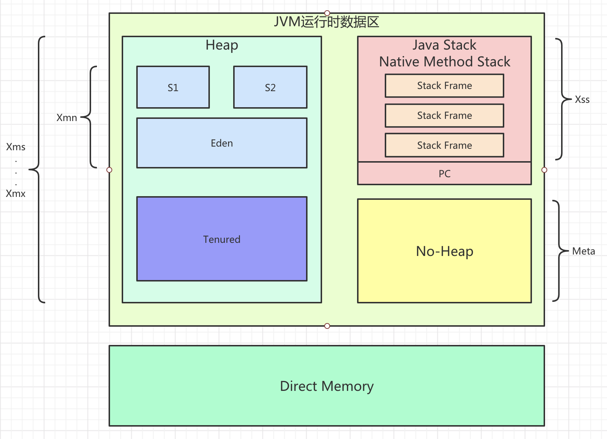
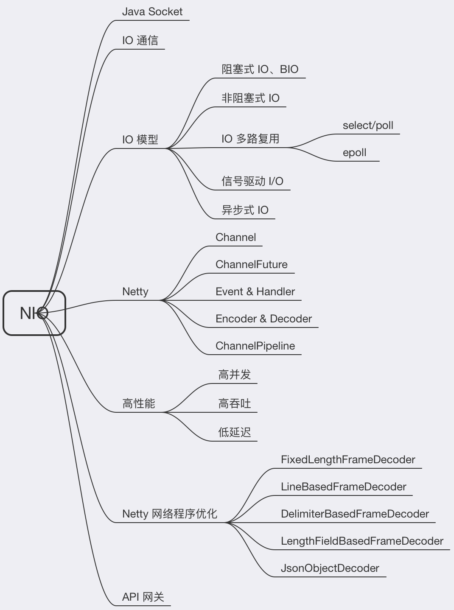
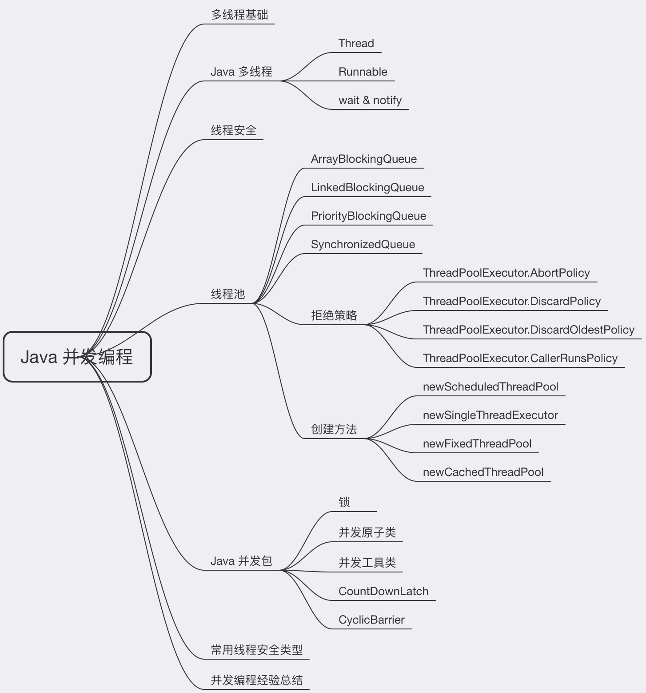
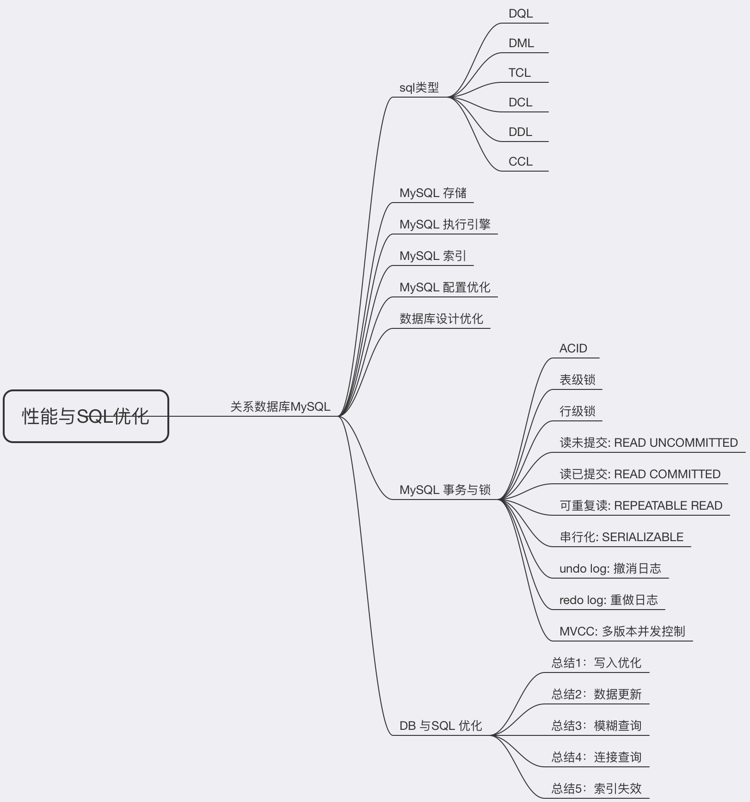
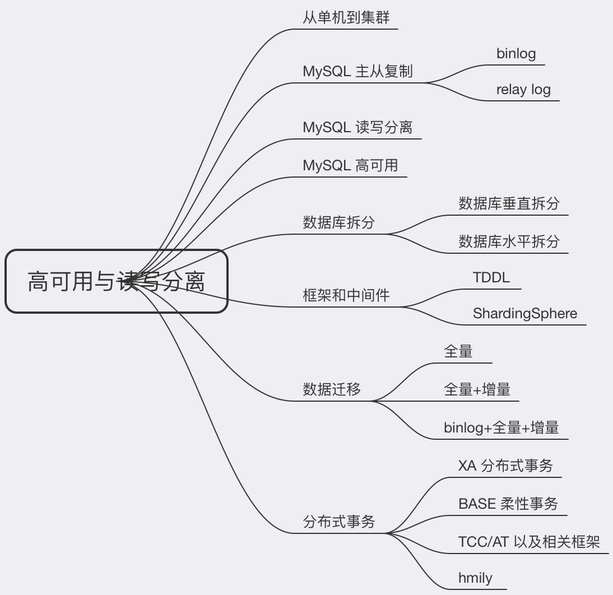
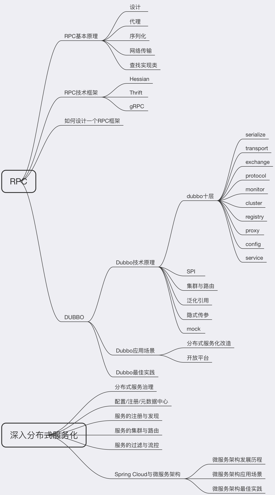
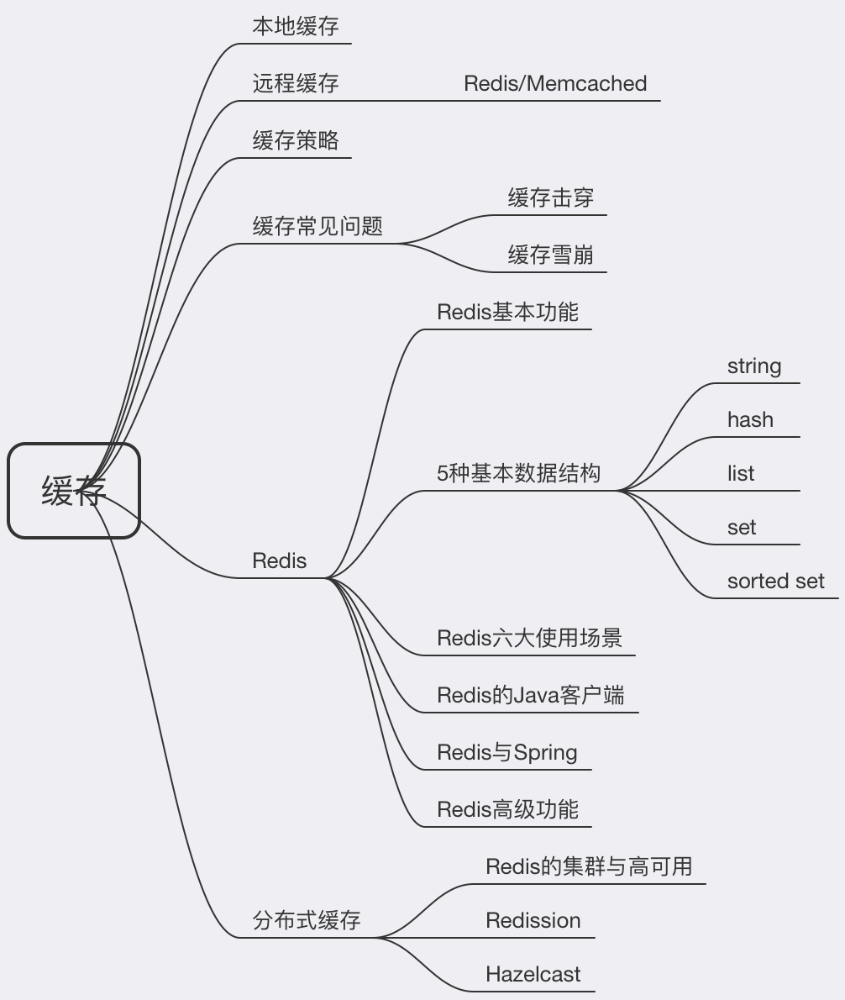
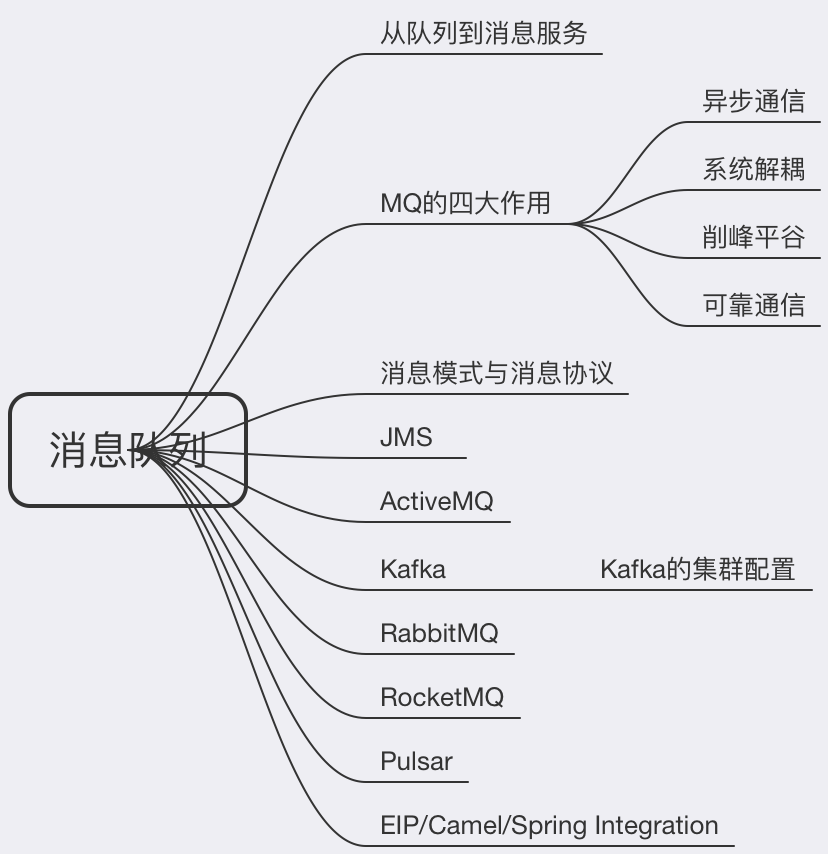

学习笔记

## 1.JVM
- `java` 内存模型和 `GC`：掌握 `JVM` 的内存模型，便于理解相关的 `GC` 算法

- 字节码和类加载相关过程：而常用的 `AOP` 其实就是对字节码的修改，可以无侵入的进行功能扩展，非常的便捷，对于理解 `Spring` 也提供了帮助。

- `GC` 收集器的各种搭配，通过不同应用下的收集器搭配
 
 
 
 
# 2.NIO
`NIO` 的学习`netty` 对后续学习中间件和网络通信、网关`rpc` 起到了帮助作用，后续也会继续深入学习
 
 
 
## 3.并发编程

发编程提升代码效率，解决单线程的瓶颈

- `Lock` 和 `syncronized` 锁的应用，多线程及线程安全的区别

- `concurrent` 包中各种工具的应用，`volatile` 原子性、临界区共享资源等概念

- 线程池的原理、拒绝策略，线程池参数配置

- 锁升级，以及CAS乐观锁理念等

  
  
## 4.Spring 和 ORM 等框架

`spring` 和 `orm` 是工作中用到的最多的，学习框架巩固了平时常用的技术，学习了单元测试的编写

- `IOC`

- `AOP`

- 实现 `springboot starter`

- `java8`

  

## 5.MySQL 数据库和 SQL

数据库在老师的带领下重新温习了一遍知识，使得自己又有了更深入的了解

对于数据库的索引、加锁、优化。集群同步等都得到了更深的理解

## 6.分库分表

目前所接触到的项目场景还没有用到分库分表的概念，通过学习，了解到了分库分表的各种解决方案：

- 垂直拆分、水平拆分的区别

- sharding-sphere读写分离、基于 订单id 的分片

- xa、tcc、at等分布式事务理念

  

## 7.RPC 和微服务

！！！非常的nice，彻底理解了 rpc 的本质，然后通过自己去写 demo 也加深了对  netty的理解，虽然目前还掌握的不到家，但对于整个概念的理解更深入了一层。

微服务也通过dubbo和 springcloud 完成了订单的demo编写
 

## 8.分布式缓存

`Redis` 部分实现了分布式锁、哨兵集群、`redis cluster`集群的搭建，加强了实战能力  加深了对于redis 的理解

## 9.分布式消息队列

了解到了 `mq` 的发展历史路程，`ActiveMQ`、`rabbitmq`、`kafka/rocket`、`pulsar` 
介绍了关于消息队列的关键原理和核心技术，学到了新型 `mq`，`pulsar` 的设计理念（计算与存储分离）通过手写的 `demo`，理解了 `mq` 的本质原理（队列）

`mq` 的四大作用：

- 异步通信：异步通信，减少线程等待，特别是处理批量等大事务、耗时操作。
- 系统解耦：系统不直接调用，降低依赖，特别是不在线也能保持通信最终完成。
- 削峰平谷：压力大的时候，缓冲部分请求消息，类似于背压处理。
- 可靠通信：提供多种消息模式、服务质量、顺序保障等。
 